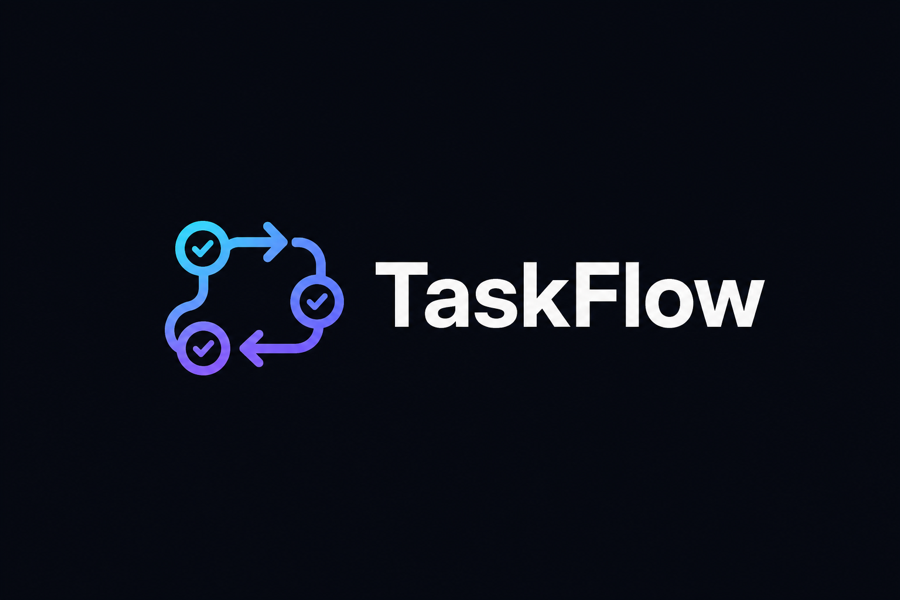
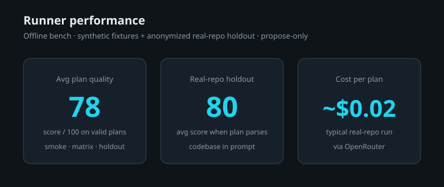

<div align="center">



<br/>

[](https://github.com/invictusdhahri/taskflow/actions/workflows/validate.yml)
[](./LICENSE)
[](https://github.com/invictusdhahri/taskflow/issues)
[](https://github.com/invictusdhahri/taskflow/pulls)
[](https://agentskills.io)
[](#)

</div>

TaskFlow is a **100% independent, GitHub-native task-flow agent skill** that doesn't sacrifice on quality.

It generates implementation-ready GitHub issues and Projects, asks before it writes, and never leaves work unassigned or duplicated.

TaskFlow helps an AI coding agent:

- bootstrap a GitHub repository + Project + MVP issues
- stand up a Project for an existing repository
- audit, deduplicate, and clean an existing Project/backlog
- produce implementation-ready issues with Caveman summaries, file lists, acceptance criteria, native Relationships, and safe write plans

It follows the open [Agent Skills](https://agentskills.io) standard and works with Cursor, Claude Code, Codex, and other compatible agents.

New Projects default to a **Board** view (Status columns). Table and Roadmap are optional extras the agent can ask about.

## Install

```bash
# project-local (recommended)
npx skills add invictusdhahri/taskflow

# install only this skill if the repo grows later
npx skills add invictusdhahri/taskflow --skill taskflow

# global install (available across projects)
npx skills add -g invictusdhahri/taskflow
```

Local / unpublished checkout:

```bash
npx skills add ./skills/taskflow
# or from the repo root
npx skills add .
```

### After install

- **Cursor:** `/taskflow` or `@taskflow`, or ask to create/audit GitHub issues and Projects
- **Claude Code / Codex / others:** ask the agent to run the TaskFlow skill, or invoke it by name if your client lists installed skills

## Discoverability

- [skills.sh](https://skills.sh/) is a directory/leaderboard, not a store
- Listing comes from install telemetry when people run `npx skills add invictusdhahri/taskflow`
- Cursor can also import via **Customize → Rules → Add Rule → Remote Rule (GitHub)** using this repo URL

## Runner

The interactive skill stays under `skills/taskflow/`. The [`runner/`](./runner/) package snapshots a GitHub repo (issues + codebase), calls the default planner via OpenRouter, and writes a **propose-only** change plan — no GitHub writes.

```bash
cd runner && cp .env.example .env && pnpm install   # set OPENROUTER_API_KEY
pnpm plan -- --repo OWNER/REPO
# → results/plans/<id>.json
```

Bench overview (smoke → matrix → holdout; fixtures anonymized):



Optional re-bench: `pnpm bench` in [`runner/`](./runner/).

## Repo layout

```text
taskflow/
├── LICENSE
├── README.md
├── assets/
│   ├── logo.png
│   └── bench/                # runner performance chart
├── .github/
│   └── workflows/
│       └── validate.yml
├── runner/                   # plan + snapshot + optional bench
└── skills/
    └── taskflow/
        ├── SKILL.md
        ├── github-operations.md
        ├── templates.md
        └── examples.md
```

## Requirements

- GitHub CLI (`gh`) authenticated to the target host
- permission to inspect/create repositories, issues, and Projects as needed
- Continue / Refuse on the change plan before any GitHub content write

## Fewer permission prompts

TaskFlow is designed to ask **once** at the start for tool access, then **once** on the change plan. It should not ask you in chat to re-approve every `gh` call.

Hosts may still show their own system permission dialogs. To quiet those:

### Claude Code

Add allow rules in `.claude/settings.json` or `~/.claude/settings.json`:

```json
{
  "permissions": {
    "allow": [
      "Bash(gh *)",
      "Bash(git *)",
      "Bash(python *)",
      "Bash(python3 *)",
      "Read",
      "Grep",
      "Glob"
    ]
  }
}
```

This skill also declares `allowed-tools` for `gh` / `git` / read helpers on agents that honor skill frontmatter (skill-invoke turn).

### Cursor

Use auto-run / terminal allow settings so approved `gh` and git commands are not re-prompted every time. Plan Continue / Refuse still gates GitHub mutations.

## What this is not

- Not an npm library
- Not a hosted SaaS
- Not automatic issue spam — TaskFlow proposes a versioned change plan and waits for approval

## License

[MIT](./LICENSE)
